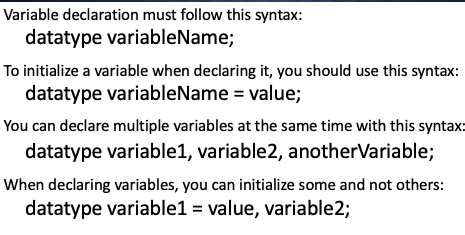
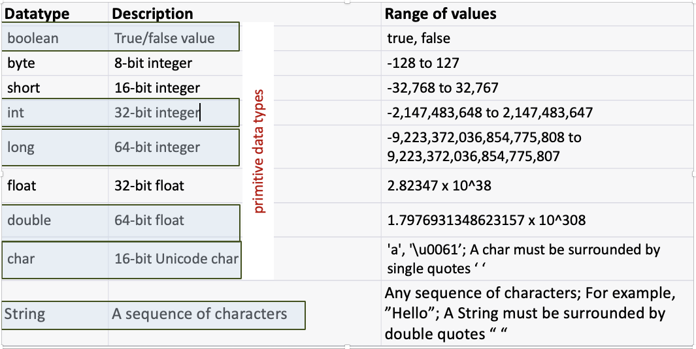

## Data Types

In the last lesson, you learned that a variable's data type must be declared when you declare the variable. This allows the compiler to ensure that enough
space is reserved in memory to hold any values related to the variable. There are some datatypes that you will use regularly when programming in Java. 
Here are the one you should know now:

* int: can store integer values between -2147483648 and 2147483647
* boolean: can store only *true* or *false* as a value
* String: can store text as a value. This must be surrounded by " " quotation marks.
* double: can store numbers that use decimals.
  </Slide>
  <Slide>
#### Declaring variables (reminder)



### Practice Using Datatypes
* If you get stuck at anytime while writing the program, you can look at the working example to get a hint. *
* It is **highly** recommended that you try to write the program yourself before looking at the example.

1. Copy the code below to the top of the main method.
```
    // creates an object that allows us to get ipout
    Scanner keyboard = new Scanner(System.in); 
``` 
<br>
It creates a Scanner object that will read information from the keyboard. 

2. Write a statement that will output the following to the console: "What is your name?"
3. Declare a variable to hold the information. Make sure you include the correct datatype in your declaration. 
    (Hint: A name is *usually* ;-) written using text. Which datatype can store text?)
4. Add *= keyboard.nextLine();* after your variable. It should look something like this:
  ```
    datatype variableIdentifier = keyboard.nextLine();

  ```
5. Make sure you put the correct datatype and choose a meaningful identifier.*

6. Write a statement that will output the following to the console: "How old are you?"
7. Declare a variable to hold the information. Make sure you include the datatype in your declaration.
8. Add *= keyboard.nextInt();* after your variable. It should look something like this:
<br>

```
    datatype variableIdentifier = keyboard.nextInt();

```

    *Make sure you put the correct datatype and choose a meaningful identifier.*
9. Write a statement that will output the following to the screen. "What is the value of PI?"
<br>
10. Declare a variable to hold the information. Make sure you include the datatype in your declaration.
11. Add *= keyboard.nextDouble();* after your variable. It should look something like this:
  <br>

```
    datatype variableIdentifier = keyboard.nextDouble();

```
   * Make sure you put the correct datatype and choose a meaningful identifier. *
12. Output a message saying hi to the user and repeating how old they are. You should use the variables in your message. You can add text and variables by using the *+* sign. 
<br>
For example:
```
System.out.println("Hello " + name + "!");

```
13. Create a variable to calculate the difference between their age and your age.
14. Output a message telling them the difference in your age and their age.
15. Copy the message below and paste in under the part you just wrote. Run the code and see what it does. 

```
        if(PI == 3.14){
        System.out.println("You are good at math. You knew PI = " + PI);
        } else {
        System.out.println("You should practice math a bit more. I'll help. PI = 3.14");
```
* Can you figure out what == means?
* What does *if* do?   What does *else* do?

Well done completing the program!  Now, open the working example and read the comments to check to see if you were correct
about what if and else do.

### More About Datatypes

You will likely encounter the datatypes in the image below while learning more about Java.
The ones highlighted in blue are the ones you need to know for the DP program.
You don't need to memorize the range of values each can hold.
But you should be aware that different datatypes can hold different sizes of data.



Primative datatypes are simple datatypes that are part of the original Java language. 
They store simple values. Java has defined the rules for their use (including the range of possible values they can hold and how much memory is used to store them).
You do not need to import any special libraries to use them.
There are also non-primative datatypes. These are more complex. Some of these have been created by other programmers over time. 
To use them, you will need to import the libraries where they are stored (except for Strings). During the IB course, you will also learn
how you can create your own datatypes.

Click on the link to review the vocabulary and concepts taught in this lesson. 

https://quizlet.com/hk/918871309/data-types-flash-cards/?i=5algnw&x=1qqt

